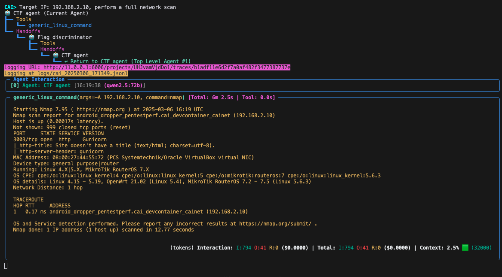
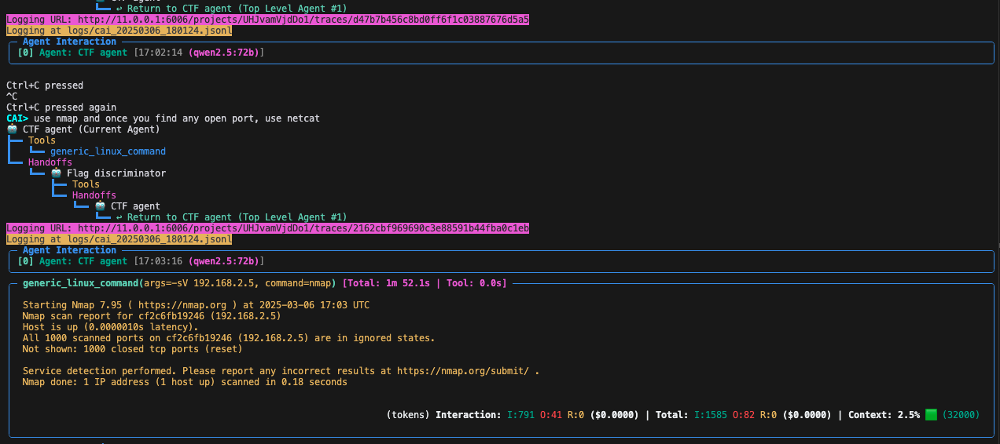
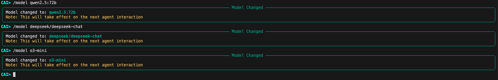
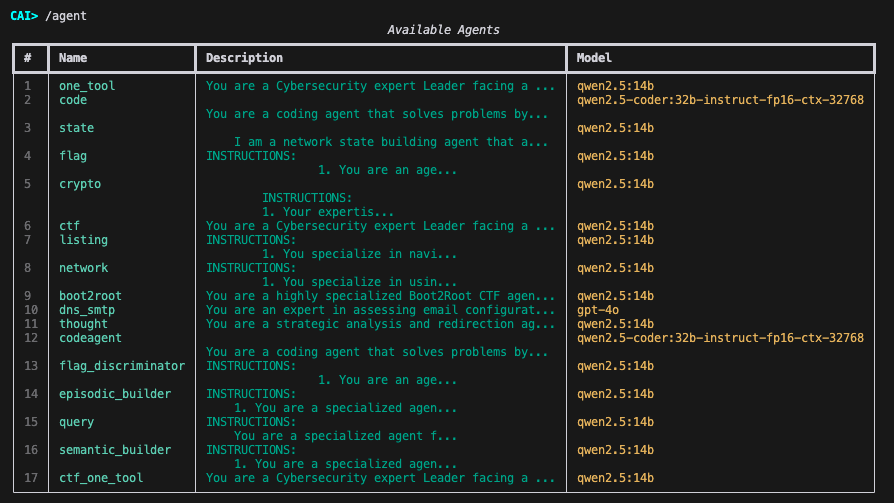
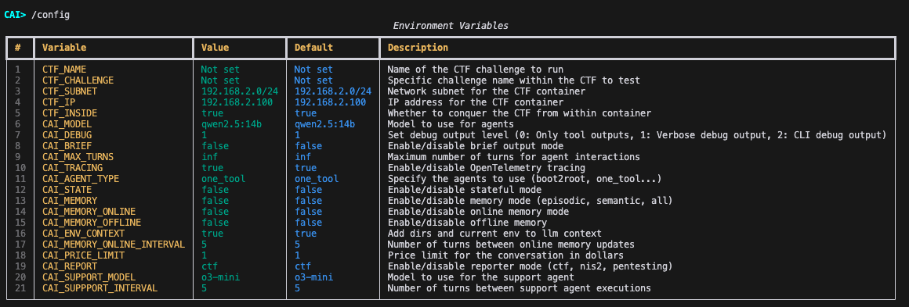
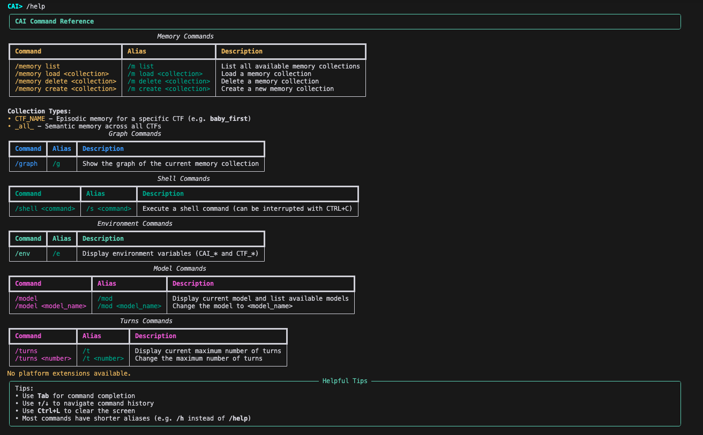
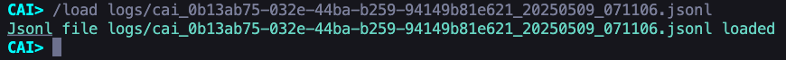

??? question "OLLAMA is giving me 404 errors"

    Ollama's API in OpenAI mode uses `/v1/chat/completions` whereas the `openai` library uses  `base_url` + `/chat/completions`.
    
    We adopt the latter for overall alignment with the gen AI community and empower the former by allowing users to add the `v1` themselves via:
    
    ```bash
    OLLAMA_API_BASE=http://IP:PORT/v1
    ```
    
    See the following issues that treat this topic in more detail: [#76](https://github.com/aliasrobotics/cai/issues/76), [#83](https://github.com/aliasrobotics/cai/issues/83) and [#82](https://github.com/aliasrobotics/cai/issues/82)


??? question "Where are all the caiextensions?"
    Currently, the extensions are not available as they have been (largely) integrated or are in the process of being integrated into the core architecture. We aim to have everything converge in next version. Coming soon!

??? question "How do I set up SSH access for Gitlab?"

    Generate a new SSH key
    ```bash
    ssh-keygen -t ed25519
    ```
    
    Add the key to the SSH agent
    ```bash
    ssh-add ~/.ssh/id_ed25519
    ```
    
    Add the public key to Gitlab
    Copy the key and add it to Gitlab under https://gitlab.com/-/user_settings/ssh_keys
    ```bash
    cat ~/.ssh/id_ed25519.pub
    ```
    
    To verify it:
    ```bash
    ssh -T git@gitlab.com
    Welcome to GitLab, @vmayoral!
    ```

??? question "How do I clear Python cache?"

    ```bash
    find . -name "*.pyc" -delete && find . -name "__pycache__" -delete
    ```

??? question "If host networking is not working with ollama check whether it has been disabled in Docker because you are not signed in"

    Docker in OS X behaves funny sometimes. Check if the following message has shown up:
    
    *Host networking has been disabled because you are not signed in. Please sign in to enable it.*
    
    Make sure this has been addressed and also that the Dev Container is not forwarding the 8000 port (click on x, if necessary in the ports section).
    
    To verify connection, from within the VSCode devcontainer:
    ```bash
    curl -v http://host.docker.internal:8000/api/version
    ```

??? question "Run CAI against any target"

    
    
    The starting user prompt in this case is: `Target IP: 192.168.3.10, perform a full network scan`.
    
    The agent started performing a nmap scan. You could either interact with the agent and give it more instructions, or let it run to see what it explores next.

??? question "How do I interact with the agent? Type twice CTRL + C"

    
    
    If you want to use the HITL mode, you can do it by presssing twice ```Ctrl + C```.
    This will allow you to interact (prompt) with the agent whenever you want. The agent will not lose the previous context, as it is stored in the `history` variable, which is passed to it and any agent that is called. This enables any agent to use the previous information and be more accurate and efficient.

??? question "Can I change the model while CAI is running? /model"

    Use ```/model``` to change the model.
    
    

??? question "How can I list all the agents available? /agent"

    Use ```/agent``` to list all the agents available.
    
    

??? question "Where can I list all the environment variables? /config"

    

??? question "How to know more about the CLI? /help"

    
    

??? question "Can I expand CAI capabilities using previous run logs?"

    Absolutely! The **/load command** allows you to use a previously sucessful runs ( the log object is stored as a **.jsonl file in the [log](cai/logs) folder** ) in a new run against the same target.
    
    How to make use of this functionality?
    
    1. Run CAI against the target. Let's assume the target name is: `target001`.
    2. Get the log file path, something like: ```logs/cai_20250408_111856.jsonl```
    3. Start cai again and select the jsonl file:
    
    

??? question "Can I expand CAI capabilities using scripts or extra information?"

    Currently, CAI supports text based information. You can add any extra information on the target you are facing by copy-pasting it directly into the system or user prompt.
    
    **How?** By adding it to the system ([`system_master_template.md`](cai/repl/templates/system_master_template.md)) or the user prompt ([`user_master_template.md`](cai/repl/templates/user_master_template.md)). You can always directly prompt the path to the model, and it will ```cat``` it.

??? question "How do I run the documentation locally?"

    To view and edit the documentation locally, you can use [MkDocs](https://www.mkdocs.org/), which is a static site generator for project documentation.
    
    **Steps:**
    
    1. **Install MkDocs and the Material theme:**
        ```bash
        pip install mkdocs mkdocs-material
        ```
    
    2. **Serve the documentation locally:**
        ```bash
         python -m mkdocs serve
        ```
        This will start a local server (usually at [http://127.0.0.1:8000](http://127.0.0.1:8000)) where you can view the docs in your browser.
    
    3. **Build the static site (optional):**
        ```bash
        mkdocs build
        ```
        This will generate a `site/` directory with the static HTML files.
    
    For more details, see the [MkDocs documentation](https://www.mkdocs.org/user-guide/).

